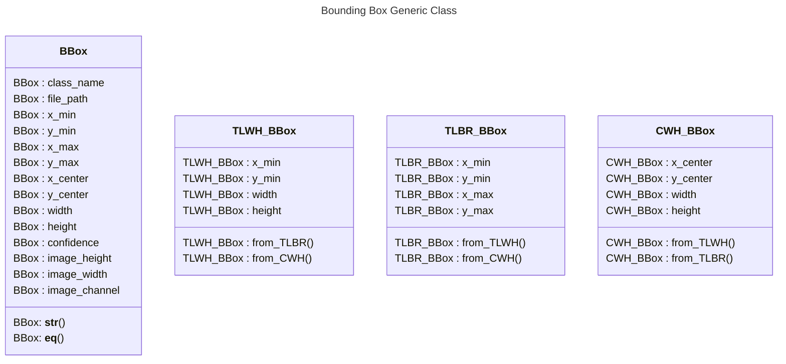

# bboxtools

## Installation

```bash
git clone https://github.com/ODAncona/bbox-tools.git
cd bbox-tools
python3 setup.py install
```

## Introduction

### What is a bounding box?

Bounding boxes are a crucial component of object detection algorithms, which are used to identify and classify objects within an image or video. A bounding box is a rectangle that surrounds an object of interest in the image, and is typically represented by a set of coordinates that define the box's position and size. These boxes can be used to locate and extract objects from an image, and can also provide important information about the size, shape, and orientation of the objects

### Various types and format

When you work with bounding box you have severals things to consider.

First, the bounding box could be stored in **different types** like:

- Top-Left Bottom-Right(TLBR), (x_min, y_min, x_max, y_max)
- Top-Left Width Height(TLWH), (x_min, y_min, width, height)
- Center Width Height(CWH), (x_center, y_center, width, height)

Which are popular among **different formats** like :

- COCO (Common Objects in Context)
- Pascal_voc (Visual Object Classes)
- YOLO (You Only Look Once)

Furthermore, the bounding box could be stored in **different file formats** like:

- csv
- xml
- json
- manifest
- parquet
- pickle

## Goal

The goal of this library is to seamlessly convert bounding box format using easy syntax.

It should be a breeze like...

```python
import bboxtools as bt

# Define path to files
input_path = './examples/example1.csv'
output_path = './examples/output/test1.csv'

# Define the header of the raw data
bbox_map = dict(
    classname='class',
    filename='filename',
    x_min='x',
    y_min='y',
    width='w',
    height='h',
    image_width='img_width',
    image_height='img_height',
)

# Read the file and export it to a new format
bbox_parser = bt.read_csv(input_path, mapping=bbox_map)
bbox_parser.export(output_path=output_path, format='yolo')
```

## Bounding box format

### Popular format

#### Pascal_VOC (TLBR, xml)

`pascal_voc` is a format used by the [Pascal VOC dataset](http://host.robots.ox.ac.uk/pascal/VOC/). coordinates of a bounding box are encoded with four values in pixels: `[x_min, y_min, x_max, y_max]`. `x_min` and `y_min` are coordinates of the top-left corner of the bounding box. `x_max` and `y_max` are coordinates of bottom-right corner of the bounding box.

#### COCO (TLWH, json)

coco is a format used by the [Common Objects in Context COCO](http://cocodataset.org/) dataset.

In coco, a bounding box is defined by four values in pixels `[x_min, y_min, width, height]`. They are coordinates of the top-left corner along with the width and height of the bounding box.

#### YOLO (CWH, txt)

In yolo, a bounding box is represented by four values `[x_center , y_center, width, height]`. `x_center` and `y_center` are the normalized coordinates of the center of the bounding box. The `width` and `height` are the normalized length. To convert YOLO in other format it is important to have the size of the image to calculate the normalization.
To normalize coordinates, we take pixel values of x and y, which marks the center of the bounding box on the x- and y-axis. Then we divide the value of x by the width of the image and value of y by the height of the image.

#### Object bounding Box JSON lines (TLWH, manifest)

Object bounding Box JSON lines is a format used by the [Amazon SageMaker](https://docs.aws.amazon.com/sagemaker/latest/dg/sms-data.html) suite.

#### albumentation (TLBR)

Albumentations is similar to pascal_voc, because it also uses four values `[x_min, y_min, x_max, y_max]` to represent a bounding box. But unlike pascal_voc, albumentations uses normalized values. To normalize values, we divide coordinates in pixels for the x- and y-axis by the width and the height of the image.

Albumentation is a library for image augmentation. It is used in the [albumentations](https://albumentations.ai/docs/getting_started/bounding_boxes_augmentation/) bounding box augmentation documentation.

### Generic format

To easily convert a bounding box to different format, a bounding box should have the following attributes:

**Mandatory**

- class_name
- file_path

**Format Specific**

| TLBR                                                              |                                   CWH                                    | TLWH                                                               |
| ----------------------------------------------------------------- | :----------------------------------------------------------------------: | ------------------------------------------------------------------ |
| <ul><li>x_min</li><li>y_min</li><li>x_max</li><li>y_max</li></ul> | <ul><li>x_center</li><li>y_center</li><li>width</li><li>height</li></ul> | <ul><li>x_min</li><li>y_min</li><li>width</li><li>height</li></ul> |

**Metadata**

- confidence
- image_height
- image_width
- image_channel




Therefore, if you want to specify your own format to the parser you can do it with a mapping like the example below:

If your CSV header looks like:

`class, top, left, w, h, img_size_x, img_size_y, filename`

You could prepare a mapping for the parser like this:

```Python

bbox_map = dict(
    class_name='class',
    file_path='filename',
    x_min='left',
    y_min='top',
    width='w',
    height='h',
    image_width='img_size_x',
    image_height='img_size_y',
)

bbox_parser = bt.read_csv('./file.json', bbox_map)
```
