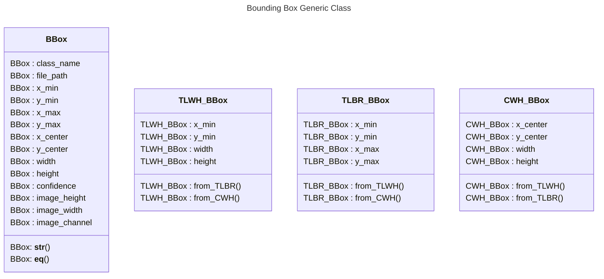

# Bounding Box Reference

To easily convert a bounding box to different format, a bounding box should have the following attributes:

- `class_name`
- `file_path`
- `x_min`
- `y_min`
- `x_max`
- `y_max`
- `x_center`
- `y_center`
- `width`
- `height`
- `confidence`
- `image_height`
- `image_width`
- `image_channels`

**Mandatory**

- class_name
- file_path

**Format Specific**

| TLBR                                                              |                                   CWH                                    | TLWH                                                               |
| ----------------------------------------------------------------- | :----------------------------------------------------------------------: | ------------------------------------------------------------------ |
| <ul><li>x_min</li><li>y_min</li><li>x_max</li><li>y_max</li></ul> | <ul><li>x_center</li><li>y_center</li><li>width</li><li>height</li></ul> | <ul><li>x_min</li><li>y_min</li><li>width</li><li>height</li></ul> |

**Metadata**

- confidence
- image_height
- image_width
- image_channel

